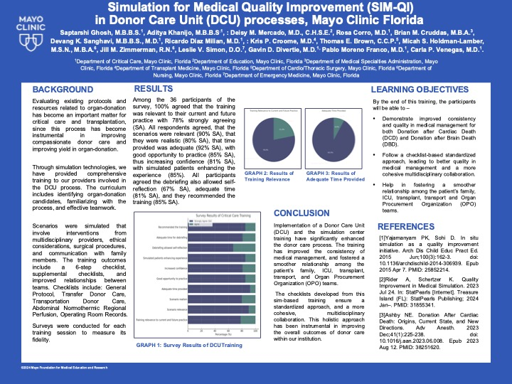
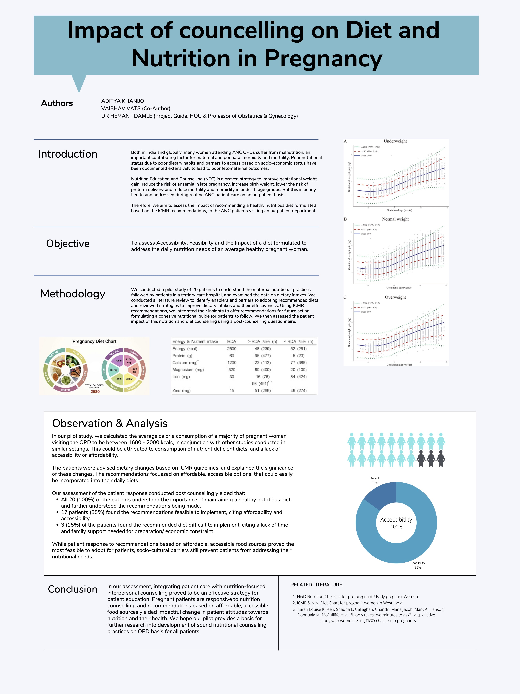
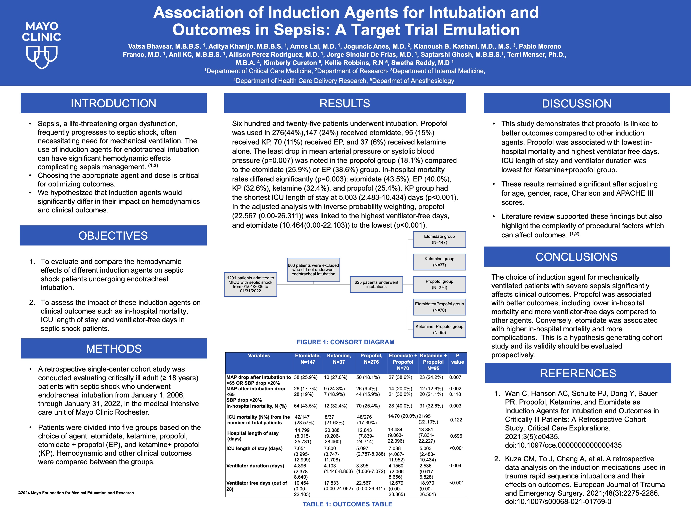

# Project Overview

This repository contains various projects related to medical quality improvement and research studies. Below are the images and descriptions of each project.

## Simulation for Medical Quality Improvement (SIM-QI) in Donor Care Unit (DCU) Processes

This project focuses on evaluating existing protocols and resources related to organ donation in the Donor Care Unit (DCU) at Mayo Clinic Florida.

## Simulation for Medical Quality Improvement (SIM-QI) in Extracorporeal Membrane Oxygenation Cardiopulmonary Resuscitation (eCPR)

This project aims to improve CPR protocols through effective incorporation of eCPR, enhancing survival in refractory cardiac arrest cases.

## Impact of Counselling on Diet and Nutrition in Pregnancy

This study assesses the impact of nutrition-focused counseling on diet and nutrition among pregnant women, aiming to improve maternal health outcomes.

## Association of Induction Agents for Intubation and Outcomes in Sepsis: A Target Trial Emulation

This research evaluates the hemodynamic effects of different induction agents on septic shock patients undergoing endotracheal intubation.

